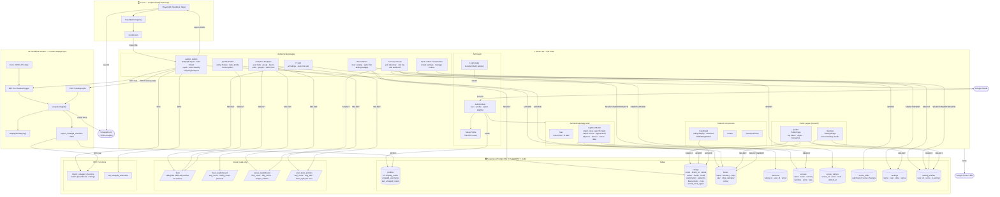

# Rounds — Architecture

```mermaid
graph TD

%% ── External services ────────────────────────────────────────────
  GoogleOAuth(["Google OAuth"])
  GoogleFonts(["Google Fonts CDN"])
  Untappd(["Untappd.com\nHTML scraping"])

%% ── Cloudflare Worker ───────────────────────────────────────────
  subgraph Worker ["☁ Cloudflare Worker — rounds-untappd-sync"]
    W_cron["Cron: 22:50 UTC daily"]
    W_run["GET /run  manual trigger"]
    W_style["POST /lookup-style"]
    W_scrape["scrapeUntappd()"]
    W_map["mapStyleCategory()"]
    W_rpc["→ import_untappd_checkins RPC"]
    W_cron --> W_run
    W_run --> W_scrape
    W_style --> W_scrape
    W_scrape --> W_map
    W_scrape --> W_rpc
  end

%% ── Local script ─────────────────────────────────────────────────
  subgraph Script ["💻 Local — scripts/classify-beers.mjs"]
    S_playwright["Playwright (headless: false)"]
    S_map["mapStyleCategory()"]
    S_json["results.json"]
    S_playwright --> S_map --> S_json
  end

%% ── Supabase ─────────────────────────────────────────────────────
  subgraph Supabase ["🗄 Supabase (PostgreSQL + PostgREST + Auth)"]

    subgraph DB_Tables ["Tables"]
      T_profiles[("profiles\nid · display_name\nuntappd_username\nlast_untappd_import")]
      T_ratings[("ratings\nscore · drank_at · venue\ncolour · clarity · head\ncarbonation · adjuncts\nflavour dims · note\nwould_seek_again")]
      T_beers[("beers\nname · brewery · style\nabv · style_category\ncolour")]
      T_reactions[("reactions\nrating_id · user_id · emoji")]
      T_venues[("venues\nname · town · country\nfacilities · price · taps")]
      T_venue_ratings[("venue_ratings\nvenue_id · score · note · visited_at")]
      T_venue_edits[("venue_edits\naudit trail of venue changes")]
      T_tastings[("tastings\nname · year · date · venue")]
      T_tasting_entries[("tasting_entries\nbeer_id · score · is_winner")]
    end

    subgraph DB_Views ["Views (read-only)"]
      V_feed[/"feed\nratings ⋈ beers ⋈ profiles ⋈ venues"/]
      V_beer_lb[/"beer_leaderboard\navg_score · rating_count per beer"/]
      V_venue_lb[/"venue_leaderboard\nvisit_count · avg_score · unique_visitors"/]
      V_taste[/"user_taste_profiles\navg_score · avg_abv · fave_style per user"/]
    end

    subgraph DB_RPC ["RPC Functions"]
      RPC_import["import_untappd_checkins\nbatch upsert beers + ratings"]
      RPC_username["set_untappd_username"]
    end

  end

%% ── React Frontend ───────────────────────────────────────────────
  subgraph Frontend ["⚛ React 19 + Vite PWA"]

    subgraph Auth ["Auth layer"]
      AuthCtx["AuthContext\nuser · profile · signIn · signOut"]
      Login["Login page\nGoogle OAuth redirect"]
      Setup["SetupProfile\nfirst-time users"]
    end

    subgraph Public ["Public pages (no auth)"]
      PubPage["/public\nPublicPage\ntop beers · styles · breweries"]
      TastPage["/tastings\nTastingsPage\nannual tasting results"]
    end

    subgraph AppShell ["Authenticated app shell"]
      Nav["Nav\nbottom bar · 6 tabs"]
      LogModal["LogBeerModal\nstep 1: beer search/create\nstep 2: score · appearance\nadjuncts · flavour · venue · date"]
    end

    subgraph Pages ["Authenticated pages"]
      Feed["/  Feed\nall ratings · real-time sub"]
      ProfileP["/profile  Profile\nrating history · taste profile\ntheme picker"]
      Beers["/beers  Beers\nbeer catalog · style filter\ntasting badges"]
      Analytics["/analytics  Analytics\nyear tabs · group · beers\npubs · people + ABV chart"]
      Venues["/venues  Venues\npub directory · visit log\nedit audit trail"]
      Admin["/admin  Admin\nUntappd import · CSV import\nrepair · auto-classify\nPlaywright import"]
      TasteAdmin["/taste-admin  TasteAdmin\ncreate tastings · manage entries"]
    end

    subgraph Components ["Shared components"]
      FeedCard["FeedCard\nrating display · reactions\nEditRatingModal"]
      Avatar["Avatar"]
      ReactionPicker["ReactionPicker"]
    end

  end

%% ── Flows: Auth ──────────────────────────────────────────────────
  Login -->|OAuth| GoogleOAuth
  GoogleOAuth -->|session| AuthCtx
  AuthCtx -->|reads| T_profiles
  AuthCtx --> Setup
  AuthCtx --> AppShell

%% ── Flows: Frontend → Supabase ───────────────────────────────────
  Feed -->|SELECT| V_feed
  Feed -->|SELECT/INSERT/DELETE| T_reactions
  ProfileP -->|SELECT| V_feed
  ProfileP -->|SELECT| V_taste
  Beers -->|SELECT| T_ratings
  Beers -->|UPDATE| T_beers
  Beers -->|SELECT| T_tasting_entries
  Analytics -->|SELECT| V_feed
  Analytics -->|SELECT| V_beer_lb
  Analytics -->|SELECT| V_venue_lb
  Analytics -->|SELECT| V_taste
  Venues -->|SELECT| V_venue_lb
  Venues -->|INSERT/UPDATE| T_venues
  Venues -->|INSERT| T_venue_ratings
  Venues -->|INSERT| T_venue_edits
  Admin -->|RPC| RPC_import
  Admin -->|RPC| RPC_username
  Admin -->|UPDATE| T_beers
  TasteAdmin -->|SELECT/INSERT| T_tastings
  TasteAdmin -->|SELECT/INSERT/DELETE| T_tasting_entries
  PubPage -->|SELECT| T_ratings
  PubPage -->|SELECT| T_beers
  PubPage -->|SELECT| T_tasting_entries
  TastPage -->|SELECT| T_tastings
  TastPage -->|SELECT| T_tasting_entries
  LogModal -->|SELECT/INSERT| T_beers
  LogModal -->|INSERT| T_ratings
  LogModal -->|SELECT| T_venues
  FeedCard -->|UPDATE| T_ratings

%% ── Flows: Worker ────────────────────────────────────────────────
  W_scrape -->|HTTP fetch| Untappd
  W_rpc -->|RPC call| RPC_import
  W_rpc -->|PATCH| T_profiles
  Admin -->|POST /lookup-style| W_style
  Admin -->|GET /run| W_run

%% ── Flows: Script ────────────────────────────────────────────────
  S_playwright -->|search| Untappd
  Admin -->|export JSON| S_playwright
  S_json -->|import file| Admin

%% ── Flows: Static ────────────────────────────────────────────────
  Frontend -->|fonts| GoogleFonts
```
